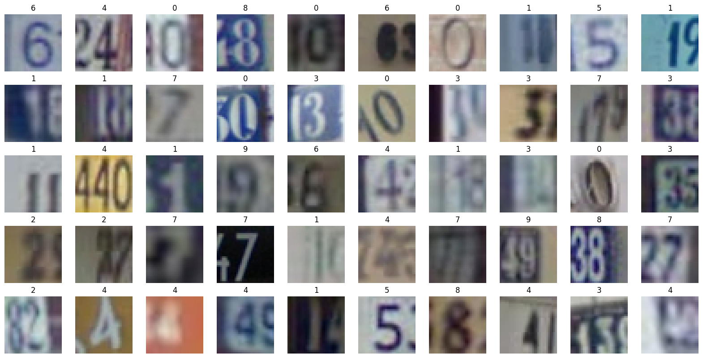
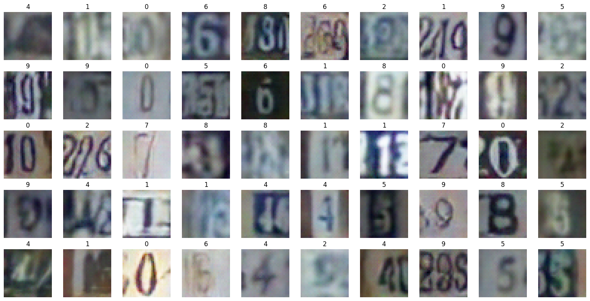

# Conditional Generative Adversarial Network (cGAN)  <!-- omit in toc -->

This repository is dedicated to the synthesis of Street View House Numbers (SVHN) images using Conditional Generative Adversarial Networks (cGANs). Our goal is to explore and demonstrate the capabilities of cGANs in generating realistic images of house numbers. Following the generation phase, these synthetic images were then used as the training data for a digit classifier, aiming to achieve high accuracy in recognizing digits in the real SVHN images.


## Table of Contents <!-- omit in toc -->

- [Contributors](#contributors)
- [SVHN Dataset](#svhn-dataset)
- [A Primer on cGANs](#a-primer-on-cgans)
- [Results](#results)
- [Prerequisites](#prerequisites)
- [Setup](#setup)
  - [Installation](#installation)
  - [Repository Structure](#repository-structure)
  - [Source Code Tree](#source-code-tree)

## Contributors

- [Philemon Thalmann](https://github.com/PhilemonAT)
- [Armin Begic](https://github.com/arminbegic)
- [Jan Schlegel](https://github.com/Gamma1024)

## SVHN Dataset
The [Street View House Numbers (SVHN) dataset](http://ufldl.stanford.edu/housenumbers/) consists of over `600'000` `32x32` RGB images of house numbers obtained from Google Street View images. Moreover, it contains `10` classes, corresponding to the digits `0-9`. Note that the labels belong to the center digit of the house number, which are often surrounded by some distractor digits. The dataset is split into three subsets: `train`, `test`, and `extra`. The `train` and `test` subsets contain `73'257` and `26'032` images, respectively. Finally, the `extra` split contains `531'131` images. See the below-depicted grid of example images from the SVHN dataset:




## A Primer on cGANs


Conditional Generative Adversarial Networks are an extension of the basic GAN architecture, introducing a way to generate data conditioned on certain inputs. Unlike traditional GANs that generate data from a noise vector alone, cGANs take additional information (in our case labels) as input, guiding the data generation process to produce more specific or controlled outputs.

The architecture consists of two main components: the generator and the discriminator. The generator learns to produce realistic data given the condition, while the discriminator evaluates the authenticity of the generated data and its conformity with the given condition. The two components are trained simultaneously in a minimax game, where the generator aims to fool the discriminator, and the discriminator aims to distinguish between real and fake data.


## Results

Below you can find some example images that were generated using our cGAN model. These images were synthesized after training the cGAN for `100` epochs (on the train set only). The images are generated by conditioning the generator on the class labels `0-9` and a random noise vector. 




The generated images are then used to train a digit classifier. This classifier, a simple CNN, is subsequently evaluated on the actual SVHN test set. This process results in an accuracy rate of approximately `75%`, in contrast to the roughly `90%` accuracy rate attained by the classifier when trained on the actual SVHN training set.

## Prerequisites
For animating the training progress we make use of the `ffmpeg` command-line tool. To install it run the following command on e.g. Ubuntu:

```bash
sudo apt-get install ffmpeg
```

or on MacOS:

```bash
brew install ffmpeg
```
Finally, we refer to [this tutorial](https://phoenixnap.com/kb/ffmpeg-windows) for installing `ffmpeg` on Windows.

## Setup
Follow the instructions below to set up the project on your local machine.
### Installation

Start by cloning this repository:

```bash
git clone git@github.com:Gamma1024/Conditional-GAN.git
cd Conditional-GAN
```

Further, to replicate our results we suggest setting up a conda environment (or any other virtual environment) and then installing the required packages:

```bash
conda create -n cgan python=3.10 pip
conda activate cgan
pip install -r requirements.txt
```

### Repository Structure
- `train.py`: Script for training the cGAN model.
- `validation.py`: Script for evaluating the classifier, which was trained on cGAN generated images, on the SVHN test set.
- `config/config.yaml`: Configuration file containing hyperparameters and other settings.
- `utils.py`: Utility functions for model saving and loading, model training and evaluation as well as visualization.
- `run.sh`: Bash script for running `train.py` and `validation.py` and tracking the training progress in tensorboard.

### Source Code Tree
```bash
.
├── animations                                   # Directory containing animations                       
│   └── gan_training_progress.mp4                      # Animation of some generated images during training
├── classifier.py                                # Script containing the classifier model
├── config                                       # Directory containing the configuration file
│   └── config.yaml                                    # Configuration file containing hyperparameters
├── gan                                          # Directory containing the GAN model
│   ├── discriminator.py                               # Script containing the discriminator model
│   └── generator.py                                   # Script containing the generator model
├── img                                          # Directory containing example images
│   ├── svhn_example_images.png                        # Example images from the SVHN dataset
│   └── svhn_gan_generated_example_images.png          # Example images generated by the cGAN
├── README.md
├── requirements.txt                             # File containing the required packages
├── run.sh                                       # Bash script for running the training and evaluation
├── train.py                                     # Script for training the cGAN model         
├── utils.py                                     # Script for utility functions 
└── validation.py                                # Script for evaluating the classifier on the SVHN test set
```